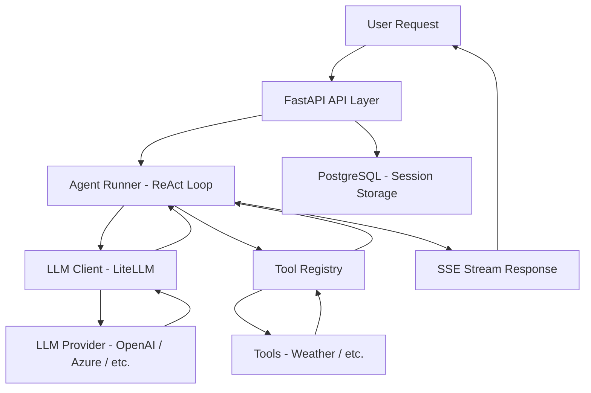

# AI Agent 微服务架构文档

## 系统概述

本项目是一个生产级单智能体（Single Agent）微服务框架，基于 FastAPI 构建，采用 ReAct（Reasoning + Acting）循环模式，通过调用外部工具完成用户任务，并以 SSE（Server-Sent Events）流式推送执行过程与结果。

## 系统架构图

## 模块职责说明

### app/api/routes.py
HTTP 接口层。定义 REST API 端点，接收用户请求，返回 SSE 流式响应。负责请求验证、响应序列化和错误处理。

### app/core/config.py
配置管理模块。基于 pydantic-settings，从环境变量和 .env 文件加载配置，提供全局单例 Settings 实例。

### app/core/logging.py
日志模块。统一日志格式与级别，为所有模块提供一致的日志记录能力。

### app/core/agent_runner.py
Agent 运行时核心。实现 ReAct Loop 骨架，协调 LLM 推理与工具调用，以 AsyncGenerator 方式逐步产出 StreamEvent，驱动 SSE 流式输出。

### app/services/llm_client.py
LLM 调用适配层。封装 LiteLLM，提供同步/流式两种调用模式，屏蔽底层 LLM Provider 差异。

### app/services/database.py
数据库服务层。管理 async SQLAlchemy 引擎与会话，定义 ORM 模型，提供 FastAPI 依赖注入。

### app/tools/registry.py
工具注册中心。管理所有可用工具的元数据与可调用函数，供 Agent Runner 查询和调用。

### app/tools/weather_tool.py
示例工具。返回 Mock 天气数据，演示工具注册与调用的标准模式。

### app/models/schemas.py
数据模型层。定义请求、响应、SSE 事件等 Pydantic v2 模型，确保数据校验与序列化的一致性。

### app/main.py
应用入口。创建 FastAPI 实例，注册路由，配置 CORS 和生命周期事件。

## 技术栈

| 组件 | 技术 | 版本 |
|------|------|------|
| Web 框架 | FastAPI | 0.115.0 |
| ASGI 服务器 | Uvicorn | 0.30.6 |
| 数据模型 | Pydantic | 2.9.0 |
| 配置管理 | pydantic-settings | 2.6.0 |
| ORM | SQLAlchemy (async) | 2.0.36 |
| 数据库驱动 | asyncpg | 0.29.0 |
| LLM 调用 | LiteLLM | 1.50.0 |
| 流式输出 | sse-starlette | 2.1.3 |
| 数据库 | PostgreSQL | 15+ |
| 容器化 | Docker + Docker Compose | - |

## 数据流

1. 用户发送 POST 请求到 `/api/v1/chat/stream`
2. FastAPI 路由层验证请求，创建 SSE 连接
3. Agent Runner 初始化 ReAct Loop，构造 system prompt 和 user message
4. 每轮循环：Agent Runner 调用 LLM Client 获取模型响应
5. 若模型返回 tool_calls：Agent Runner 从 Tool Registry 获取工具函数并并发执行
6. 工具结果追加到 messages，进入下一轮循环
7. 若模型返回最终回答（finish_reason == "stop" 且无 tool_calls）：输出 final_answer 事件
8. 整个过程中，每个关键节点都通过 SSE 推送 StreamEvent 给客户端
