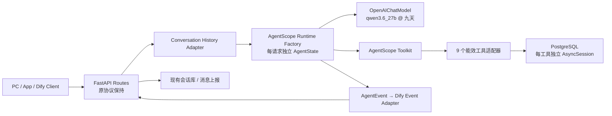

# AgentScope 全量迁移设计

**日期：** 2026-08-10

**状态：** 待书面评审

**目标版本：** AgentScope 2.0.5

**生产模型：** `qwen3.6_27b`

## 1. 背景与结论

当前项目已经具备完整的业务能力：FastAPI/Dify 协议、PostgreSQL 会话与业务数据、9 个能效工具、双阶段 Prompt、Excel/ECharts 产物。主要问题在于 Agent 运行时层为自研实现：`agent_runner.py` 负责 ReAct 循环、上下文裁剪、工具调用解析、流/非流降级和并发执行；`llm_client.py` 通过 LiteLLM 适配模型；`registry.py` 维护另一套工具协议。这三层与 AgentScope 的 `Agent` / `OpenAIChatModel` / `Toolkit` / `AgentEvent` 高度重叠。

本次采用“**AgentScope SDK 全量替换内核，Dify 外部协议保持不变**”的方案。迁移完成后，自研 ReAct Loop、LiteLLM 客户端和自研 ToolRegistry 均被删除；业务 SQL、工具返回结构、会话表以及对外 API 继续作为稳定边界。

## 2. 范围与成功标准

### 范围内

- 将 Agent 推理与工具循环替换为 AgentScope 2.0.5 `Agent.reply_stream()`。
- 将 LiteLLM 替换为 AgentScope `OpenAICredential` + `OpenAIChatModel`。
- 将 9 个业务工具接入 AgentScope `Toolkit`，保留现有 JSON Schema 与工具名。
- 用 AgentScope `AgentEvent` 驱动 Dify SSE 与 blocking 响应，移除内部 `StreamEvent`。
- 保留“执行 Prompt → 按工具类型总结 Prompt”的双阶段行为，但改用原生 function calling，不再要求模型输出 `<tool>...</tool>`。
- 保留每个并发工具调用独立 SQLAlchemy `AsyncSession` 的隔离约束。
- 默认模型改为 `qwen3.6_27b`，通过环境变量连接九天 OpenAI-compatible 端点。

### 对外兼容性

下列边界不改名、不改主要字段语义：

- `/api/v1/chat/stream`
- `/api/v1/chat-messages` 的 streaming 与 blocking 模式
- 会话列表、会话详情、消息持久化和文件下载接口
- Dify `message` / `agent_thought` / `message_end` / `error` 事件结构
- 9 个工具的名称、参数 Schema、业务结果与下载链接规则

### Definition of Done

- 运行时代码不再 import LiteLLM、`app.services.llm_client`、`app.core.agent_runner` 或 `app.tools.registry`。
- `requirements.txt` 精确锁定 `agentscope==2.0.5`，并移除 LiteLLM。
- 所有现有测试与新增特征/单元/集成测试通过。
- 九天真实模型烟测覆盖非流式文本、流式文本、单工具调用和工具参数 Schema。
- 日志、文档、Git diff 和测试产物中不出现 API Key。
- Docker/Python 3.11 环境可启动，健康检查通过，Dify 流式事件顺序与基线一致。

## 3. 方案选择

### 方案 A：SDK 内核替换，保留服务边界（采用）

FastAPI 和现有会话库继续承担身份、协议和持久化；AgentScope 只接管 Agent 运行时、模型、工具和事件。这是“内部全量迁移”，同时将外部变更面控制在可回归范围。

### 方案 B：直接改为 AgentScope Agent Service（本次不采用）

Agent Service 还会接管 Web 服务、会话/状态和多租户级边界。当前项目已有 Dify 兼容 API、自有会话表与消息上报协议，同时替换会导致客户端、数据迁移和运行时调整耦合，不利于定位回归。

### 方案 C：长期保留双运行时（本次不采用）

可以用于短期 A/B 比对，但不作为最终形态。长期保留两套循环、工具 Schema 和事件协议会让修复成本翻倍。最终版本以前一个容器镜像/Git 版本作为回滚点，不保留生产双轨开关。

## 4. 目标架构

### 建议模块

| 模块 | 职责 |
|---|---|
| `app/agent/model.py` | 从 `Settings` 创建 `OpenAICredential` 和 `OpenAIChatModel`；集中超时、重试、上下文长度与生成参数 |
| `app/agent/tools.py` | 将业务函数包装为 `ToolBase`，直接提供现有 Schema、并发安全属性、权限决策与 DB session 边界 |
| `app/agent/toolkit.py` | 显式构造 AgentScope `Toolkit`；它是唯一的工具注册源 |
| `app/agent/messages.py` | 将已持久化的 OpenAI/Dify 历史消息转为 `UserMsg` / `AssistantMsg` |
| `app/agent/middleware.py` | 根据本轮是否已有工具结果切换执行/总结 Prompt，并实现业务级日志与错误归一化 |
| `app/agent/runtime.py` | 每次请求创建 Agent + AgentState，加载历史，调用 `reply_stream()` |
| `app/agent/dify_events.py` | 将 AgentScope 事件翻译为现有 Dify SSE/blocking 语义，累计答案和 token usage |

`app/api/routes.py` 仅保留 HTTP 参数处理、Dify envelope、持久化与错误响应，不再包含 Agent 运行时细节。

## 5. 请求与状态模型

1. Route 读取现有会话历史，保留最近 `MAX_HISTORY_MESSAGES` 条的现有业务策略。
2. `messages.py` 将 `role=user` 转为 `UserMsg`，`role=assistant` 转为 `AssistantMsg`；持久化的 system 内容不直接传入 AgentScope，而作为受控的 `User Context` 注入项目 system prompt。
3. 每个 HTTP 请求创建新的 `Agent` 与 `AgentState(session_id=conversation_id, context=converted_history)`，将历史消息一次性载入 state。不在进程内缓存可变 Agent 对象，避免多用户串会话和多 worker 状态不一致。
4. `reply_stream()` 只接收本次新增的 `UserMsg`，避免历史被重复追加；Route 消费 AgentEvent 并生成对外事件。
5. 回答结束后仅持久化清理后的最终答案，不将 ThinkingBlock、工具参数或工具原始结果当作用户可见对话。

对话真值源仍为现有数据库，而非进程内 AgentState。这保持多 worker 横向扩容能力，也避免本次顺带引入 AgentScope 状态存储迁移。

## 6. 模型适配

### 配置

- `DEFAULT_MODEL=qwen3.6_27b`
- `LLM_BASE_URL=<OpenAI-compatible endpoint>`
- `LLM_API_KEY=<runtime secret>`
- `LLM_MAX_TOKENS`、`LLM_TEMPERATURE`、`LLM_TIMEOUT_SECONDS`、`LLM_CONTEXT_SIZE`、`LLM_MAX_RETRIES`

`OpenAICredential.api_key` 使用 AgentScope/Pydantic `SecretStr`。API Key 只能通过运行时环境变量或生产密钥管理注入；`.env.example` 只保留占位符。禁止在源码、设计文档、测试 fixture、日志或命令行中保存真实密钥。

`OpenAIChatModel` 使用：

- `stream=True`：主路径保持流式。
- `context_size`：显式配置，不假设非 OpenAI 模型卡的默认值。
- `client_kwargs={"timeout": ...}`：统一连接/读取超时。
- `Parameters(max_tokens=..., temperature=..., parallel_tool_calls=True)`。
- SDK 层重试只保留一层，避免 Agent `ModelConfig` 与 Model 内部重试成倍放大流量。

### 九天协议验证

真实端点测试是 opt-in 烟测，不在 CI 默认执行。测试顺序：

1. 最小非流式对话，确认模型名和 Chat Completions 路径。
2. 最小流式对话，确认 delta、finish reason 与 usage 字段。
3. 强制单工具调用，确认 `tools` / `tool_choice` / JSON Schema 兼容性。
4. 包含 `required`、`enum`、array 和 nullable 参数的工具调用。
5. 并发工具调用能力；若端点不支持，则仅对模型参数关闭 `parallel_tool_calls`，工具执行层仍保留 AgentScope 的并发能力。

任一测试失败都先记录实际响应形状，再在 model factory 边界做最小兼容配置，不把供应商特例散落到 Route 和业务工具中。

## 7. Toolkit 与业务工具

每个现有工具被包装为项目级 `ToolBase` 适配器，而不是继续使用装饰器副作用注册。适配器：

- 显式设置 `name`、`description`、`input_schema`、`is_concurrency_safe` 和 `is_read_only`。
- `check_permissions()` 返回 `ALLOW`，因为这些是已经由服务 API 授权的固定业务能力；报表/图表产物类工具的 `is_read_only=False`。
- 对需要 DB 的工具，`call()` 在每次调用中创建独立 `AsyncSession`；不在 Agent、Toolkit 或适配器实例上持有可变 session。
- 用 `dumps_decimal()` 将现有 dict 结果序列化为 `ToolChunk(TextBlock(...))`，并把 `tool_name`、可直出的 `direct_answer` 和真实 `download_url` 放入 `ToolChunk.metadata`；不在 metadata 重复保留大体量原始查询数据。
- 失败返回 `ToolResultState.ERROR`，错误内容可供 Agent 自我修正；内部异常栈只记日志，不输出给前端。

AgentScope 根据 `is_concurrency_safe` 对工具调用分批，可并发工具由其原生 `asyncio.gather()` 执行。业务代码不再自己构造 TaskGroup 来执行模型返回的工具批次。

## 8. Prompt 与回答策略

### 原生 function calling

`AGENT_EXECUTION_PROMPT` 删除 `<tool>JSON</tool>` 的所有要求和示例包装，改为“需要数据时必须调用已提供工具”。工具参数唯一真值源为 Toolkit JSON Schema，不在 Prompt 中复制参数结构。

### 双阶段切换

`EnergyPromptMiddleware.on_system_prompt()` 检查当前 `AgentState.context`：

- 尚无本轮成功 ToolResult：返回格式化后的 `AGENT_EXECUTION_PROMPT`。
- 已有 ToolResult：以本轮第一个成功工具作为 primary tool，返回 `get_synthesis_prompt(primary_tool)`。

总结阶段仍允许 AgentScope 进入下一轮 ReAct，用于“先查指标、再生成图表”等多工具链。`ReActConfig.max_iters` 使用现有 `agent_max_steps`。达到上限时，对外返回稳定错误语义，不由 Route 再发起第二套强制汇总调用。

### `report_content` 直出

这是现有生产行为，不能因迁移而丢失。事件适配层记录每个 ToolResult 的 metadata：当本轮只有一个成功工具且结果带有非空 `report_content` 时，将其设为 canonical answer，附加真实 `download_url`，并屏蔽后续模型改写的文本。实现时优先用 `on_reply` 中间件安全短路；若 SDK 的生成器终止语义无法保证完整 `ReplyEndEvent`，则让 Agent 内部完成但由对外事件适配器选择 canonical answer。

## 9. AgentEvent 到 Dify 协议的映射

| AgentScope 事件 | Dify/项目行为 |
|---|---|
| `ReplyStartEvent` | 发出首个空 `message`，建立 task/message/conversation ID |
| `TextBlockDeltaEvent` | 发出增量 `message.answer`；按 block ID 去重 |
| `ToolCallStart/Delta/EndEvent` | 累积 tool name 与 JSON arguments，不立即暴露不完整参数 |
| `ToolResultStart/TextDelta/EndEvent` | 与 tool call 合并为一条 `agent_thought`；观测值使用现有 Decimal-safe 序列化 |
| `ModelCallEndEvent` | 累加 input/output token，生成现有 usage metadata |
| `ExceedMaxItersEvent` | 转换为可识别的 Agent 上限错误/结束原因 |
| `ReplyEndEvent(COMPLETED)` | 持久化最终问答并发出 `message_end` |
| `ReplyEndEvent(ERROR/INTERRUPTED)` | 发出 Dify `error`；不将半成品当作成功回答持久化 |

streaming 与 blocking 必须消费同一个事件适配器；blocking 只是聚合同一事件流，不维护另一套 Agent 调用。这样可避免两种模式的答案、usage 和错误语义分叉。

## 10. 错误、超时与可观测性

- 配置缺失、模型调用失败、工具执行失败、事件适配失败使用不同的项目异常类，最终归一为对外安全错误。
- 工具业务失败通过 `ToolResultState.ERROR` 回馈给 Agent，允许在 `max_iters` 内更正参数；未知异常不向客户端暴露 SQL、连接串或堆栈。
- 流式读取超时由 OpenAI 客户端 `timeout` 统一管理。不保留“已输出部分 token 后重新发起非流式调用并按字符长度拼接”的自研降级，因为它可能产生重复或错位文本。
- 日志包含 request/conversation/reply/tool ID、耗时、结束原因与 token usage；不记录 Authorization header、API Key、数据库密码或完整模型请求体。

## 11. 测试策略

严格按 TDD 进行：每个迁移行为先写失败测试，确认失败原因后再写最小实现。

### 特征基线

- 快照 9 个工具的 OpenAI function schema，确保迁移前后工具名、属性、required/enum 不变。
- 固化 Dify streaming 事件金丝序列：无工具回答、单工具、并发多工具、`report_content` 直出、工具失败、Agent 超限。
- 固化 blocking 响应与 streaming 最终答案/usage 的一致性。
- 固化历史消息转换、system context 注入、会话保存和答案清理行为。

### 新运行时单元测试

- model factory 精确传递 model/base URL/temperature/max tokens/context size/timeout，且 repr/log 不泄露密钥。
- `ToolBase` 适配器保留 Schema，每次调用独立 session，成功/失败状态和 metadata 正确。
- AgentScope 并发工具时不共享 SQLAlchemy session。
- Prompt middleware 在首轮/工具后切换正确，不再产生 `<tool>` 文本协议。
- AgentEvent 适配器的 delta 去重、工具参数累积、thought 序号、usage 累加、结束原因和错误映射。
- 每请求独立 AgentState，相同 conversation ID 的并发请求不共享可变对象。

### 集成与真实模型测试

- 使用可编程 fake `ChatModelBase` 驱动完整 Agent → Toolkit → AgentEvent → Dify 链路，不依赖外网。
- 用 FastAPI 测试客户端验证两个入口与会话端点。
- 用运行时环境变量执行九天 opt-in smoke tests；测试命令不内联密钥，测试输出仅显示响应类型、事件种类和断言结果。

## 12. 实施阶段

1. **基线阶段**：在不改生产代码的前提下补齐特征测试和快照。
2. **依赖与模型阶段**：引入 `agentscope==2.0.5`，实现 model factory 与离线测试，完成九天协议烟测。
3. **Toolkit 阶段**：将 9 个业务工具迁入 `ToolBase`/`Toolkit`，去除装饰器注册副作用。
4. **Agent 阶段**：实现 message adapter、Prompt middleware、request-scoped Agent factory 和 AgentEvent adapter。
5. **API 切换阶段**：让 streaming/blocking 入口同时切到 AgentScope 事件流，运行协议回归测试。
6. **清理阶段**：删除 `app/core/agent_runner.py`、`app/services/llm_client.py`、`app/tools/registry.py` 以及已失效配置项，更新启动流程和文档。
7. **验证与交付阶段**：执行全量测试、编译/import 检查、真实模型烟测、启动/健康检查和密钥扫描，检查最终 diff。

每个阶段使用独立、可评审的 Conventional Commit。现有工作区中用户未提交改动作为迁移基线被保留，不回滚、不覆盖；在与迁移文件重叠时优先理解并兼容。

## 13. 部署与回滚

- 在开发分支上完成全量切换，最终代码不保留 legacy runtime 开关。
- 部署前在预发执行 Dify 协议回归、真实数据工具查询与九天模型烟测。
- 生产先小流量/单实例更新，观察模型错误率、工具成功率、首 token 时延、总耗时、对话持久化成功率和 token 用量。
- 回滚使用上一个已验证容器镜像/Git 版本，不依赖生产双轨代码。本次不改数据库 Schema，因此回滚无数据迁移阻断。

## 14. 非目标

- 不在本次引入 AgentScope Agent Service 的会话/多租户托管。
- 不改写能效业务 SQL、分析规则、Excel 格式或 ECharts 数据结构。
- 不同时引入多 Agent、MCP、RAG、长期记忆或新前端。
- 不更改现有会话表 Schema 和下游消息上报协议。

## 15. 待书面确认的设计点

本文默认以下选择已成立：

1. “全部改过去”指 Agent 内核全量切换，但不破坏现有 Dify 外部协议和会话数据库。
2. 最终删除旧 runner/client/registry，不在生产长期保留双运行时。
3. 保留 `report_content` 直出与真实 `download_url` 原样返回约束。
4. 会话状态仍以现有数据库为真值源，Agent 对象按请求创建。
5. 生产默认模型为 `qwen3.6_27b`，密钥仅用于 opt-in 真实烟测与部署环境。
